## P3 数据库存储引擎

我们将关注“disk-oriented”的 DBMS 架构  数据需要落盘   一般是非易失的

磁盘管理模块的存在就是为了**同时获得易失性存储器的性能和非易失性存储器的容量，让 DBMS 的数据看起来像在内存中一样。**

### 计算机存储架构

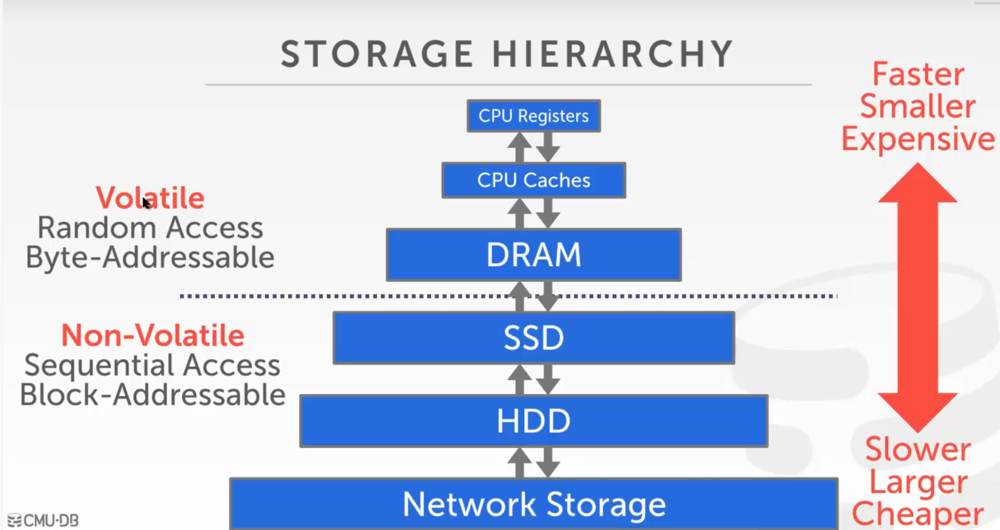

volatile  易失的存储    比如内存中的数据   支持随机获取 可以按照字节寻址  这意味着程序可以跳转到任何字节地址并获取那里的数据。

Non-Volatile  只能顺序访问  按照块/页寻址    这意味着为了读取特定偏移处的值，程序首先必须将 4 KB 页面加载到保存程序要读取的值的内存中。   非易失性存储传统上更适合顺序访问（同时读取多个连续的数据块）

就按照存取速度来说  连续存储往往比随机存储块很多。

对于我们数据库存储引擎的设计来说

1.用户的存取是随机的，而我们要做的是减少随机的存取，尽量转化成对对数据库的连续的存取

2.DBMS 支持管理超出可用内存量的数据库

3.尽量减少磁盘的读写和减小性能消耗

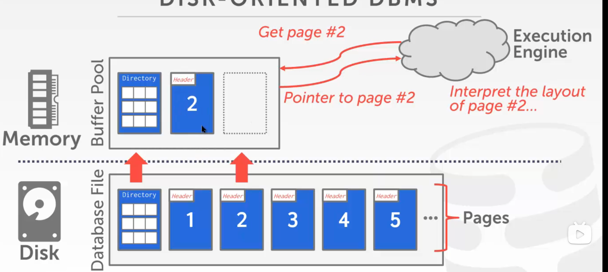

面向磁盘的DBMS 概述 数据库都在磁盘上，数据库文件中的数据被组织成页，第一页是目录页。为了对数据进行操作，DBMS 需要将数据带入内存。它通过一个缓冲池来管理磁盘和内存之间来回的数据移动来做到这一点。 DBMS 也有一个执行引擎来执行查询。执行引擎将向缓冲池请求特定页面，缓冲池将负责将该页面放入内存并为执行引擎提供指向内存中该页面的指针。缓冲池管理器将确保当执行引擎在该部分内存上运行时页面存在


### MMAP

DMBS可以使用MMAP(memory mapping) 让OS替自己管理内存

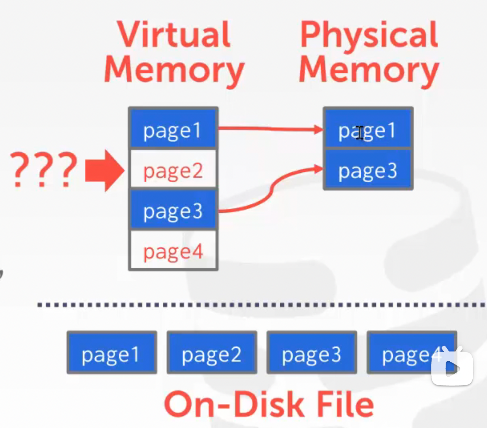

我们希望 DBMS 在等待从磁盘获取数据时能够处理其他查询。这个高级设计目标就像虚拟内存，其中有很大的地址空间和操作系统从磁盘引入页面的地方。实现这种虚拟内存的一种方法是使用 mmap，由操作系统去管理物理内存页面的装载和卸载，以及虚拟内存的链接过程     不过物理内存装满了 OS也不知道哪个页面可以卸载，所以mmap的方法可能卡主。此外，mmap对只读访问支持很好，但是对并发写的场景可能出现问题	 一些解决方案：madvice mlock  msync  告诉OS 哪些建议卸载 不要卸载 现在就可以立刻落盘	 

为什么不适用OS？  os is not your firend 

 数据库设置的目标是希望通过DMBS可以自己去管理数据和内存之间的流动。

好处：1.可以控制脏数据读写 ，将 dirty pages 按正确地顺序写到磁盘  

2.支持预先读取 3.可控的替换策略  4.线程、进程管理


### 数据库存储两大关键问题：

1.数据库数据在磁盘上如何呈现，落到什么文件里 

2.如何管理数据和内存间的数据流动

##### 第一个问题:

#### 1.File Storage 文件的存储

存储管理器负责管理数据库文件。操作系统对这些文件的内容一无所知。只有 DBMS 知道如何破译解析它们的内容，因为它是以特定于 DBMS 的方式编码的。 DBMS 的存储管理器负责管理数据库的文件。它将文件表示为页面的集合。它还跟踪已读取和写入页面的数据以及这些页面中有多少可用空间。

一个页就是一小块数据， 这个文件可能存储tuples ,meta-data,indexes,log records 大多数系统页的类型都是确定的 装入确定类型的数据 有些系统是自解释的 。 每个页都有一个唯一ID。如果数据库是单个文件，则页面 id 可以只是文件偏移量。	大多数 DBMS 都有一个间接层，将页面 id 映射到文件路径和偏移量。系统的上层将要求一个特定的页码。然后，存储管理器必须将该页码转换为文件和偏移量才能找到该页。大多数 DBMS 使用固定大小的页面来避免支持可变大小页面所需的工程开销.。

页的大小 ，对于硬件 和 OS 等一般都是4KB， 数据库应用的页 一般是512B~16KB之间  。 512B 磁盘页很小 用于单片机等等，对于16KB的数据库页，相当于就是写入了4个操作系统的页  硬件页大小是保证原子写入的最小页 这意味着如果我们的数据库页面大于我们的硬件页面，DBMS 将不得不采取额外的措施来确保数据被安全地写出，因为当系统崩溃时，程序可以在将数据库页面写入磁盘的过程中完成。    mysql 16KB  sqlite 4kB  sqlserver 8K


不同 DBMS 管理 pages 的方式不同，主要分为以下几种：

- Heap File Organization
- Sequential/Sorted File Organization
- Hashing File Organization

堆文件

这里有几种方法可以找到 DBMS 想要的页面在磁盘上的位置，堆文件组织就是其中一种方法。堆文件是一个无序的页面集合，其中元组以随机顺序存储。 DBMS 可以使用页面链接列表或页面目录在给定页面 id 的磁盘上定位页面。 

一个堆文件中的页面一般是如何组织的？查找时 单文件很容易找到页   多个堆文件 需要一些其他的元数据  比如目录之类的

1. 链表：头页保存指向 空闲页列表 free page list 和 数据页列表 data page list的指针。但是，如果 DBMS 正在寻找特定页面，它必须对数据页面列表进行顺序扫描，直到找到它正在寻找的页面。
2.  页面目录：DBMS 维护特殊页面，跟踪数据页面的位置以及每个页面上的可用空间量


#### 2.Page Layout  每个页的布局 

每个页 都有header ，该header 记录有关页面内容的元数据：	 • 页面大小。 • 校验和。 • DBMS 版本。 • 事务可见性。 • 压缩信息

Page Size  Checksum  DBMS Version  	Transaction Visibility 		Compression Information 

（有些系统表的结构信息和数据都放在页中  像 Oracle 等一些系统是这样。  每个页都放了元数据信息  不需要去访问存元数据信息的表 缺点是占用了额外的空间）


有缺陷的想法：page layout 的一个插入新数据的方法是跟踪 DBMS 在一个页面中存储了多少元组，然后在每次添加新元组时附加到末尾。缺陷1.一旦出现删除操作，每次插入就需要遍历一遍，寻找空位，否则就会出现空间浪费

​		缺陷2.无法处理变长的数据记录（tuple）

在页面中布局数据有两种主要方法：（1) slotted-pages 和 (2) log-structured。

header 中的 slot array 记录每个 slot 的信息，如大小、位移等

slotted-pages：slot 记录了数据在页中的位置，映射到页内偏移量，有点类似于索引。 是当今 DBMS 中最常用的方法。header记录使用的槽数、最后使用的槽的起始位置的偏移量，以及跟踪每个元组开始位置的槽数组。 • 添加一个元组，槽数组从头到尾增长，元组的数据从尾到头增长。当槽数组和元组数据相遇时，页面被认为是满的。 

1.新增记录时：在 slot array 中新增一条记录，记录着改记录的入口地址。slot array 与 data 从 page 的两端向中间生长，二者相遇时，就认为这个 page 已经满了

2.删除记录时：假设删除 tuple #3，可以将 slot array 中的第三条记录删除，并将 tuple #4 及其以后的数据都都向下移动，填补 tuple #3 的空位。而这些细节对于 page 的使用者来说是透明的

3.处理定长和变长 tuple 数据都游刃有余

目前大部分 DBMS 都采用这种结构的 pages。

跟踪每一个turple数据，一般通过一个唯一的行id号  record identifier: page_id + offset/slot  行号id 是数据库内部的概念 应用不能直接使用这个id

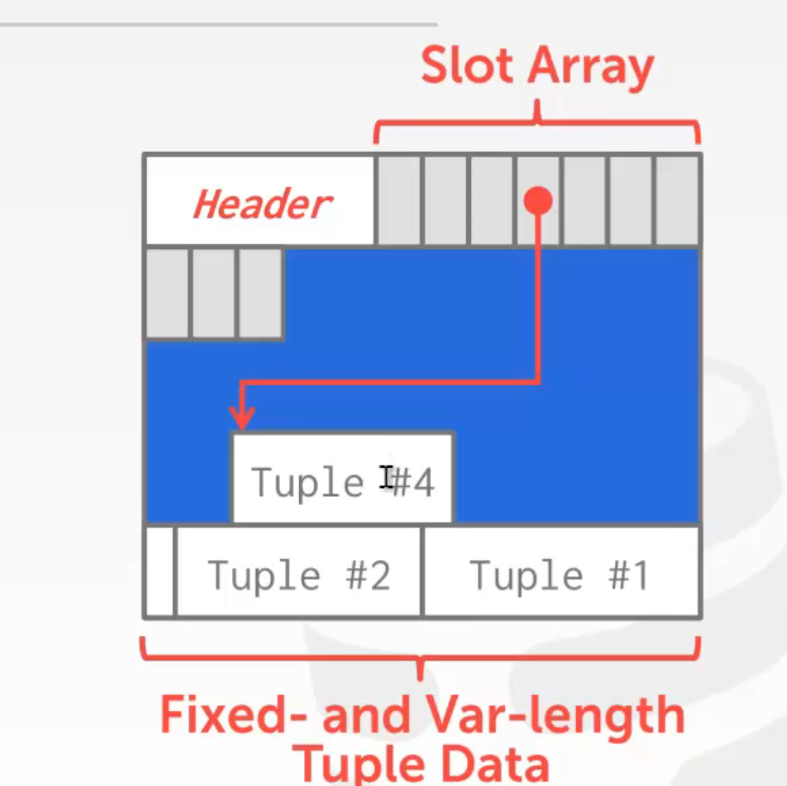

Log-Structured：DBMS 不存储元组数据本身，只存储日志记录。 

• 将数据库修改方式（插入、更新、删除）的记录存储到文件中。 

• 为了读取记录，DBMS 向后扫描日志文件并“重新创建”元组。

 • 快速写入，潜在的缓慢读取。

 • 在仅附加存储上运行良好，因为 DBMS 无法返回并更新数据。

 • 为避免长时间读取日志，DBMS 可以有索引以允许它跳转到日志中的特定位置(比如找出id=3的所有日志记录)。它还可以定期压缩日志。 （如果它有一个元组，然后对其进行了更新，它可以将其压缩为仅插入更新的元组。）压缩的问题是 DBMS 最终会出现写放大。 （它一遍又一遍地重写相同的数据） 压缩一般是一个页内进行压缩

日志压缩常用在K-V数据库上，因为只有一个键一个值，只有一个字段，修改后的字段就是最新的值

日志可以按层压缩    或者是没有层的概念 通用的压缩方法

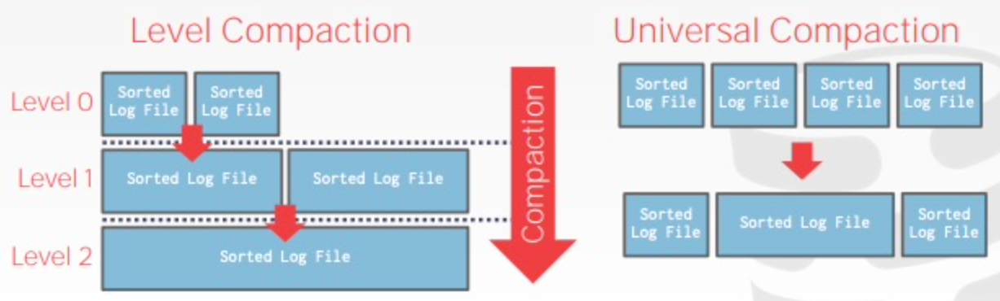

好处： 随机写 可以变成顺序写  大量写的时候 比较方便   读的时候不太方便 压缩也有开销

#### 3.Tuple Layout 一个元组的布局 也就是一行

元组本质上是一个二进制的字节序列。将这些字节解释为属性类型和值是 DBMS 的工作。


元组标头：包含有关元组的元数据。 

​		• DBMS 的并发控制协议的可见性信息 Visibility info（即，关于哪个事务创建/修改了该元组的信息）。

​		 • NULL 值的Bit Map 。  数据可以存NULL  Header有二进制为 可以表示后面的数据是否为NULL 

为什么需要NULL的Bit map 。因为turple之间是没有分隔符的，读数据可能错误的把NULL当成下一个数据

 tuple 的header 中不需要存储schema 的meta-data 


• 请注意，DBMS 不需要在此处存储有关数据库模式的元数据。元组数据：属性的实际数据。 • 属性通常按照您在创建表时指定的顺序存储。 • 大多数 DBMS 不允许元组超过页面的大小。唯一标识符： • 为数据库中的每个元组分配一个唯一标识符。 • 最常见：页面id +（偏移量或槽位）。 • 应用程序不能依赖这些id 来表示任何东西。非规范化元组数据：如果两个表相关，DBMS 可以“预连接”它们，因此这些表最终位于同一页面上。这使得读取速度更快，因为 DBMS 只需加载一页而不是两个单独的页面。但是，由于 DBMS 需要为每个元组提供更多空间，因此更新成本会更高


float, real, double 类型的数字按照 IEEE-754 标准存储，它们都是 fixed-precision，在 range 和 precision 上作了取舍，无法保证精确度要求很高的计算的正确性，如：0.3 = 0.29999999999999998890

数据库如何保证浮点数也是准确的    -=》 字面量转化成字符串 

如果希望允许数据精确到任意精度（arbitrary precision），则可以使用 numeric/decimal 类型类存储，它们就像 VARCHAR 一般，长度不定，以 Postgres 的 NUMERIC 为例

比如Postgres : numeric 格式  用一个复杂的结构体去存储数据信息 来避免数据的偏差

```c
typedef unsigned char NumericDigit;
typedef struct {
    int ndigits;           // # of Digits
    int weight;            // Weight of 1st Digit
    int scale;             // Scale Factor
    int sign;              // Positive/Negative/NaN
    NumericDigit * digits; // Digit Storage
} numeric;
```


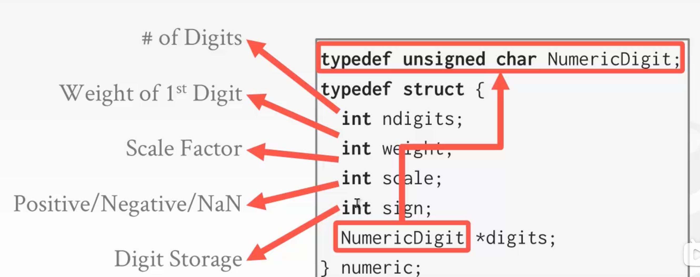

// 指针指向char 即为字符串   

存储字符串的大小大于页大小 会页溢出

大部分 DBMSs 不允许一个 tuple 中的数据超过一个 page 大小，如果想要存储这样的 large values，DBMS 通常会使用 **overflow/TOAST page： **     比如postgres 大于2k 的数据 放入单独的溢出页来存储 (overflow pages)

Mysql 一个页至少存两行数据  大于1/2size 就溢出了 。

溢出页存不下继续指向下一个溢出页

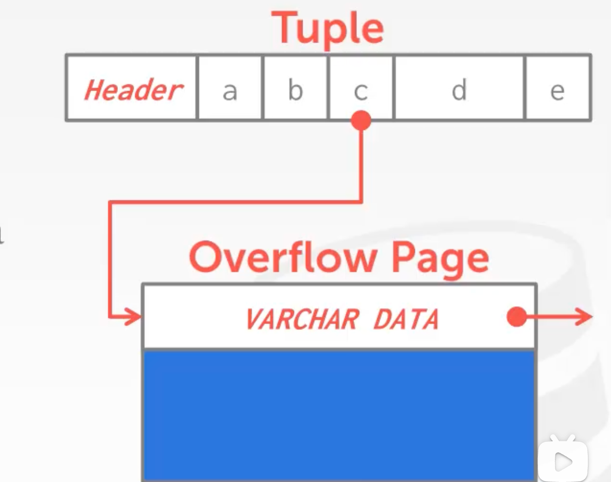


#### System Catalogs

除了数据本身，DBMS 还需要存储数据的元数据，即数据字典，它们包括：

- Table, columns, indexes, views
- Users, permissions
- Internal statistics

数据库的元数据也是系统数据表，几乎所有 DBMSs 都将这些元数据也存储在一个特定的数据库中，它们本身也会被存储为 table、tuple。根据 SQL-92 标准，你可以通过 INFORMATION_SCHEMA 数据库来查询这些数据库的元信息，但一般 DBMSs 都会提供更便捷的命令来查询这些信息


#### OLTP & OLAP

数据库的应用场景大体可以用两个维度来描述：操作复杂度和读写分布，如下图所示：

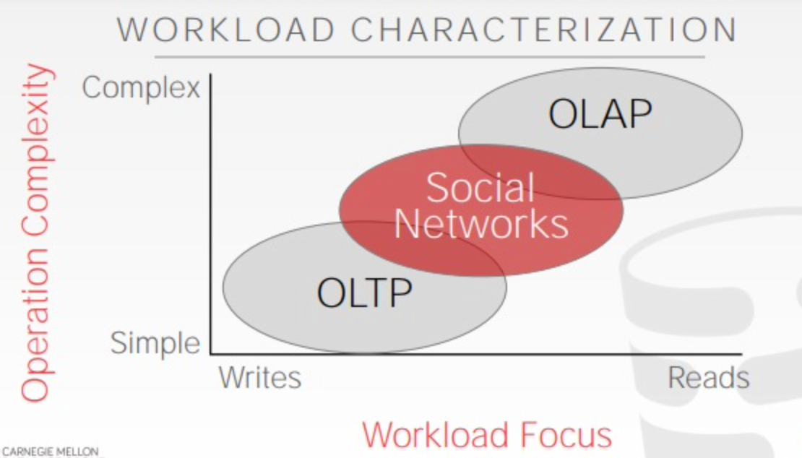

OLTP 更倾向于写        OLTP 场景包含简单的读写语句，且每个语句都只操作数据库中的一小部分数据   。 往往是小数据量的读写操作  不涉及大量数据 往往更简单  

OLAP  分析性  更倾向于读   本身往往越复杂  分析很多数据。主要处理复杂的，需要检索大量数据并聚合的操作。


公司如何规划自己的数据库系统？

OLTP DATA Silos  小型数据库

OLAP DATA Warehouse   AP型数仓 一般用来分析  

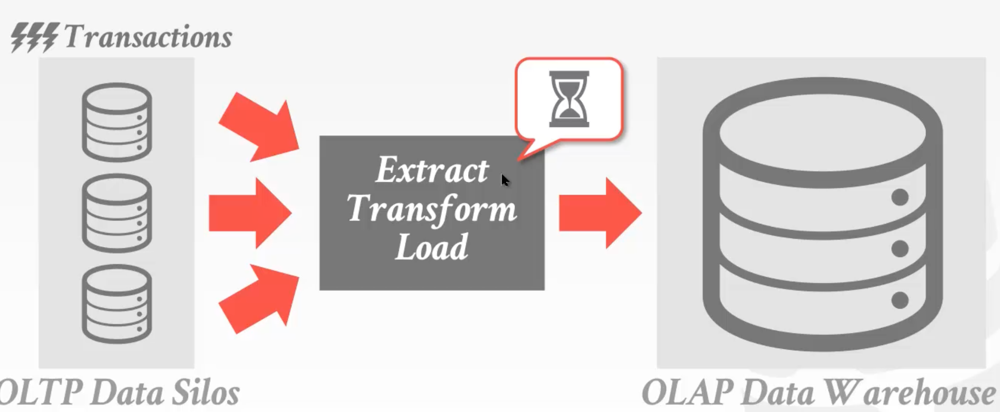

HLAP  即为同时兼顾 交易的操作和分析的操作   好处是没有数据交换的过程  而且省资源

但是难度大  难兼顾二者 


#### Data Storage Models

Relational Data Model 将数据的 attributes 组合成 tuple，将结构相似的 tuple 组合成 relation，但它并没有指定这些 relation 中的 tuple，以及 tuple 的 attributes 的存储方式。一个 tuple 的所有 attributes 并不需要都存储在同一个 page 中，它们的实际存储方式可以根据数据库应用场景优化，如 OLTP 和 OLAP。

目前常见的 Data Storage Models 包括：

-  行存储：N-ary Storage Model (NSM)      =》  更加适合OLTP    只需取出一行 与其他行无关
-  列存储：Decomposition Storage Model (DSM)


##### NSM

NSM 将一个 tuple 的所有 attributes 在 page 中连续地存储，这种存储方式非常适合 OLTP 场景，如下图所示：

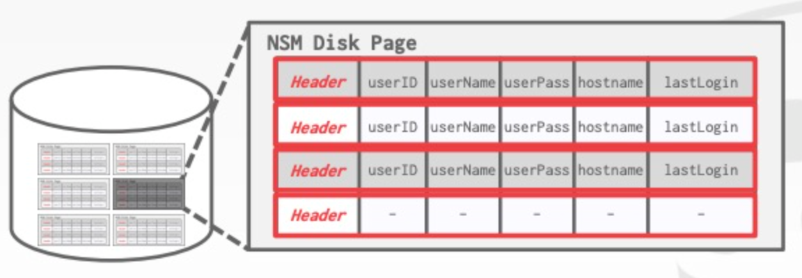

DBMS 针对一些常用 attributes 建立 Index，如例子中的 userID，一个查询语句通过 Index 找到相应的 tuples，返回查询结果

但对于一个典型的 OLAP 查询，如下图所示：

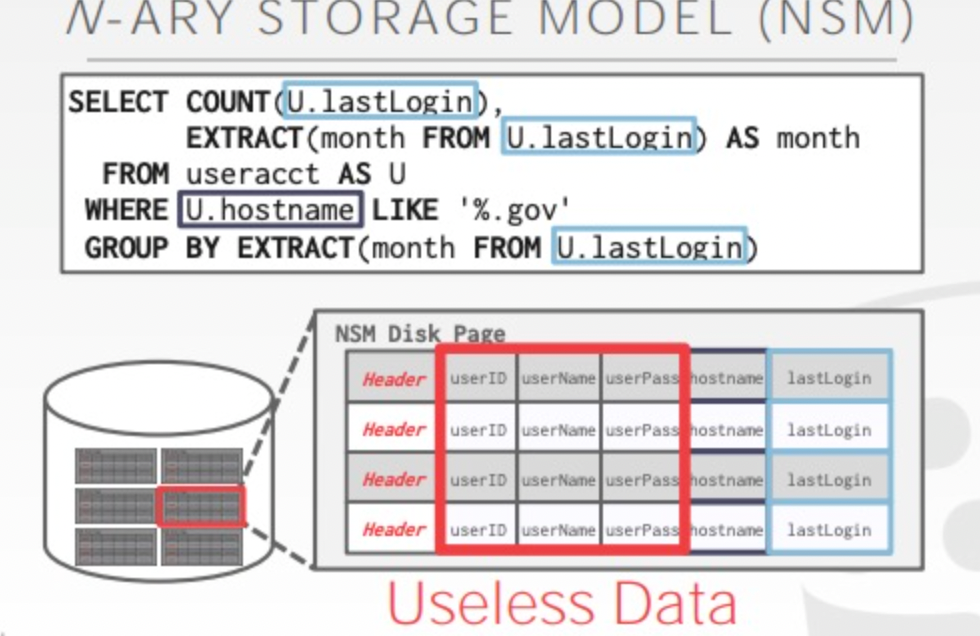

尽管整个查询只涉及到 tuple 的 hostname 与 lastLogin 两个 attributes，但查询过程中仍然需要读取 tuple 的所有 attributes。

总结一下，NSM 的优缺点如下：

- Advantages
  - 高效插入、更新、删除，涉及表中小部分 tuples
  - 有利于需要整个 tuple （所有 attributes）的查询
- Disadvantages
  - 不利于需要检索表内大部分 tuples，或者只需要一小部分 attributes 的查询

##### DSM

DSM 将所有 tuples 的单个 attribute 连续地存储在一个 page 中，这种存储方式特别适用于 OLAP 场景，如下图所示：

即 按列存储  不同的页存储不同的列

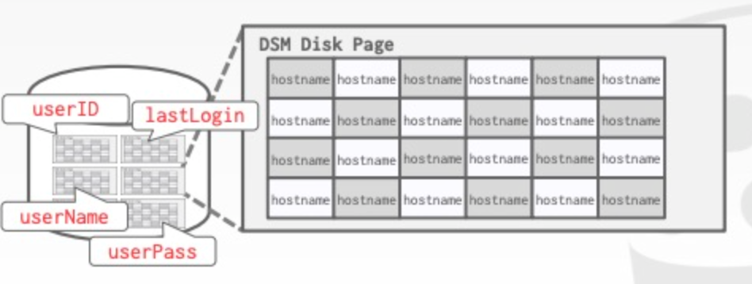

这时候，就可以优雅地处理 OLAP 查询浪费 I/O 的问题：

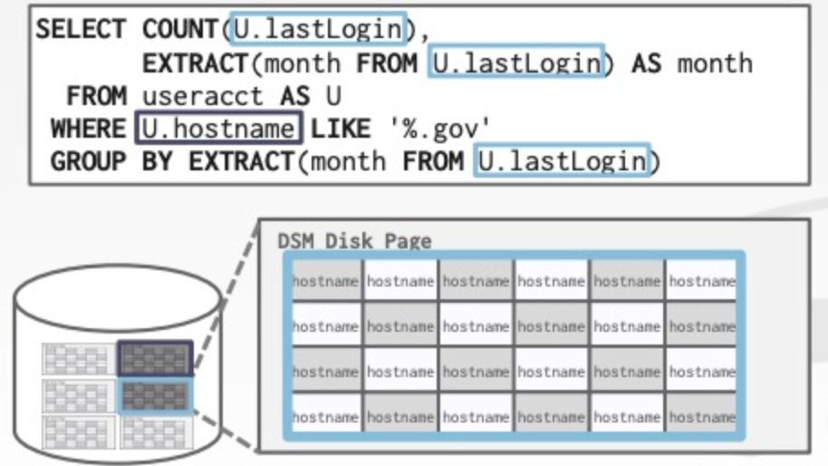

由于 DSM 把 attributes 分开存储，也引入了新的问题，比如：

如何跟踪每个 tuple 的不同 attributes？可能的解决方案有：

1. Fixed-length Offsets：每个 attribute 都是定长的，直接靠 offset 来跟踪（常用）
2. Embedded Tuple Ids：在每个 attribute 前面都加上 tupleID

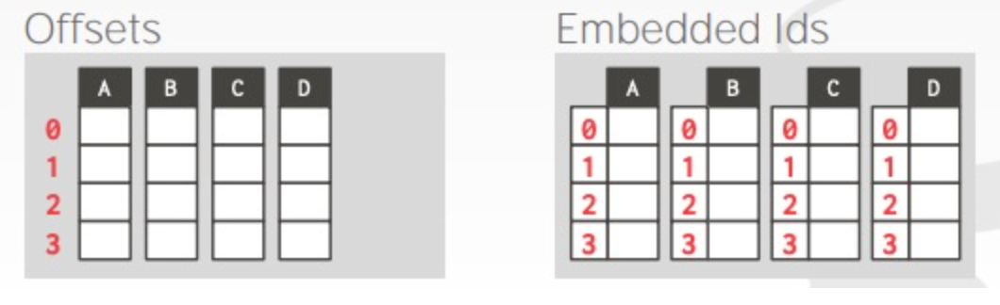

DSM 的优缺点如下：

- Advantages
  - 减少 I/O 操作
  - 更好的查询处理和数据压缩支持
- Disadvantages
  - 涉及少量 tuples、多数 attributes 的查询低效

现在如果想 高效的分析OLAP负载  基本都要想办法实现列存

 


English:   *bifurcated* 基本解释 adj.分为两部分  
