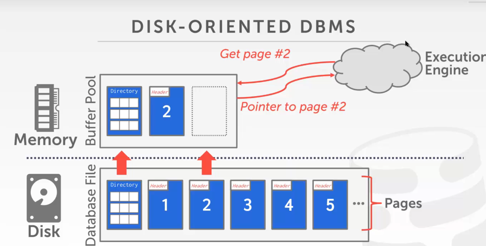
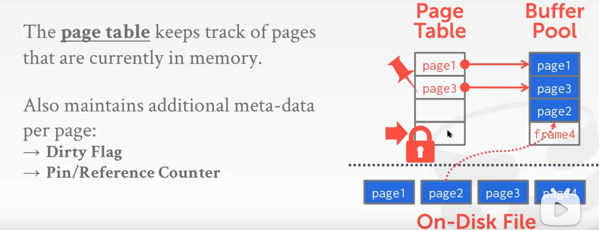
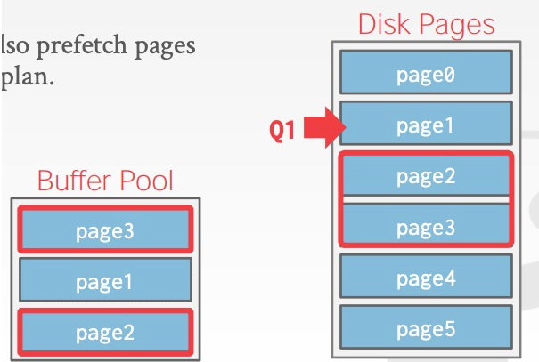
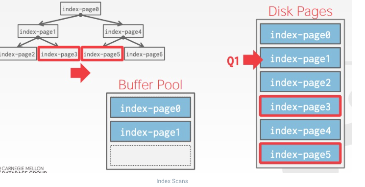

## 缓存池设计

上节中提到，DBMS 的磁盘管理模块主要解决两个问题：

1. 如何使用磁盘文件来表示数据库的数据（元数据、索引、数据表等）
2. (本节)  如何管理数据在内存与磁盘之间的移动 

本节将讨论第二个问题。管理数据在内存与磁盘之间的移动又分为两个方面：空间控制（Spatial Control）和时间控制（Temporal Control）

### Spatial Control

空间控制策略通过决定将 pages 写到磁盘的哪个位置，使得常常一起使用的 pages 能离得更近，从而提高 I/O 效率。

### Temporal Control

时间控制策略通过决定何时将 pages 读入内存，写回磁盘，使得读写的次数最小，从而提高 I/O 效率。

Buffer Pool Manager

Replacement Policies

Allocation Policies

Other Memory Pools

## Buffer Pool Manager

DBMS 启动时会从 OS 申请一片内存区域，即 Buffer Pool，并将这块区域划分成大小相同的 pages，为了与 disk pages 区别，通常称为 frames，当 DBMS 请求一个 disk page 时，它首先需要被复制到 Buffer Pool 的一个 frame 中，如下图所示：

同时 DBMS 会维护一个 page table，负责记录每个 page 在内存中的位置，以及是否被写过（Dirty Flag），是否被引用或引用计数（Pin/Reference Counter）等元信息，如下图所示：

(区分 Page Table 内存池中的索引和元信息       和    Page Directory 磁盘上 记录page id 的映射 到 文件中Page的位置)

## 缓存池优化  OPTIMIZATION

### 1.Multiple Buffer Pools

为了减少并发控制的开销以及利用数据的 locality，DBMS 可能在不同维度上维护多个 Buffer Pools：

- 多个 Buffer Pools 实例，相同的 page hash 到相同的实例上
- 每个 Database 分配一个 Buffer Pool
- 每种 Page 类型一个 Buffer Pool

具体实现方式：

1.通过ObjectId  记录主键id 查看去了哪个数据去了存在缓冲池   记录映射

2.通过哈希  放入不同的缓存池

### 2.Pre-fetching  预读取

DBMS 可以通过查询计划来预取 pages，如：

- Sequential Scans
- Index Scans

   

### 3.Scan Sharing  共享扫描

Scan Sharing 技术主要用在多个查询存在数据共用的情况。当两个查询 A, B 先后发生，B 发现自己有一部分数据与 A 共用，于是先共用 A 的 cursor，等 A 扫完后，再扫描自己还需要的其它数据。

比如两个SQL语句读同一个表，可以同步扫描，与result caching 不同，在扫描执行过程中就可以发现并且将两个扫描合成一个扫描。

Scan Shareing 可能因为优化 产生不同的结果。  比如 使用了 Limit 

### 4.Buffer Pool Bypass

旁路策略  不放进池子里

当遇到大数据量的 Sequential Scan （） 时，如果将所需 pages 顺序存入 Buffer Pool，将造成后者的污染，因为这些 pages 通常只使用一次，而它们的进入将导致一些可能在未来更需要的 pages 被移除。因此一些 DBMS 做了相应的优化，在这种查询出现时，为它单独分配一块局部内存，将其对 Buffer Pool 的影响隔离。

join 的临时结果一般也不进内存池

一般也叫  “light Scans” 轻扫描  不仅内存池的扫描

### 5.OS Page Cache

大部分 disk operations 都是通过系统调用完成，通常系统会维护自身的数据缓存，这会导致一份数据分别在操作系统和 DMBS 中被缓存两次，并且操作系统不知道什么是好的淘汰策略，且不能直接去优化磁盘IO。大多数 DBMS 都会使用 (O_DIRECT) 来告诉 OS 不要缓存这些数据，除了 Postgres。

## Buffer Replacement Policies   缓存替换策略

当 Buffer Pool 空间不足时，读入新的 pages 必然需要 DBMS 从已经在 Buffer Pool 中的 pages 选择一些移除，这个选择就由 Buffer Replacement Policies 负责完成。它的主要目标是：

- Correctness：操作过程中要保证脏数据同步到 disk
- Accuracy：尽量选择不常用的 pages 移除
- Speed：决策要迅速，每次移除 pages 都需要申请 latch，使用太久将使得并发度下降
- Meta-data overhead：决策所使用的元信息占用的量不能太大

### 1.LRU

维护每个 page 上一次被访问的时间戳，每次移除时间戳最早的 page。 

### 2.Clock

Clock 是 LRU 的近似策略，它不需要每个 page 上次被访问的时间戳，而是为每个 page 保存一个 reference bit

Clock 是LRU的一种开销优化的实现，LRU开销太大了

- 每当 page 被访问时，reference bit 设置为 1
- 每当需要移除 page 时，从上次访问的位置开始，按顺序轮询每个 page 的 reference bit，若该 bit 为 1，则重置为 0；若该 bit 为 0，则移除该 page

### 3.LRU 与 Clock 的问题

二者都容易被 sequential flooding 现象影响，从而导致最近被访问的 page 实际上却是最不可能需要的 page。为了解决这个问题，又提出了 LRU-K 策略。

### 4.LRU-K

LRU-K 保存每个 page 的最后 K 次访问时间戳，利用这些时间戳来估计它们下次被访问的时间，通常 K 取 1 就能获得很好的效果。

### 5.Localization

DBMS 针对每个查询做出移除 pages 的限制，使得这种影响被控制在较小的范围内，类似 API 的 rate limit。

### 6.Priority Hints

有时候 DBMS 知道每个 page 在查询执行过程中的上下文信息，因此它可以根据这些信息判断一个 page 是否重要。

比如 根节点的缓存最重要   优先级最高     一般数据库 刚开机就再入内存中

### 7.Dirty Pages

移除一个 dirty page 的成本要高于移除一般 page，因为前者需要写 disk，后者可以直接 drop，因此 DBMS 在移除 page 的时候也需要考虑到这部分的影响。

除了直接在 Replacement Policies 中考虑，有的 DBMS 使用 Background Writing 的方式（集中异步刷脏）来处理。它们定期扫描 page table，发现 dirty page 就写入 disk，在 Replacement 发生时就无需考虑脏数据带来的问题。脏页写入后，就可以drop或者设置标志位。

如果没有成功持久化到内存     也可以通过日志恢复      内存刷脏 但是 Log会写入，Log写入之前也好缓存   不能等待background writing定期刷脏

### 8.Allocation Policies

Allocation Policies 指 DBMS 如何为不同的查询分配内存，可以分为 Global Policies 和 Local Policies。前者指同时考虑所有查询来分配内存，后者指为单个查询分配内存时不考虑其它查询的情况。

### 9.Other Memory Pools

除了存储 tuples 和 indexes，DBMS 还需要 Memory Pools 来存储其它数据，如：

- Sorting + Join Buffers
- Query Caches             缓存主SQL语句
- Maintenance Buffers    
- Log Buffers              Log 落到磁盘之前也要缓存
- Dictionary Caches

自己做缓存 永远比OS 来的好

## English 

fast eviction   快速驱逐    指快速丢掉  不脏的页

Trade-off  权衡      ~ sth  versus  sth

