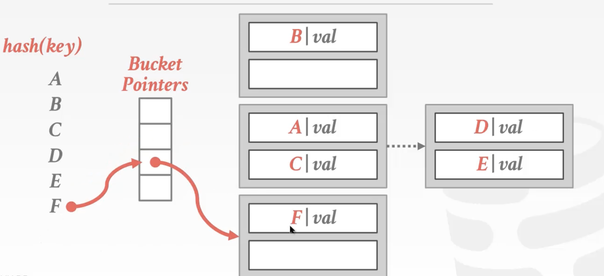

# 哈希表

先看一下目前课程的进度状态：

为了支持 DBMS 更高效地从 pages 中读取数据，DBMS 的设计者需要灵活运用一些数据结构及算法，其中对于 DBMS 最重要的两个是：

- Hash Tables        
- Trees

它们可能被用在 DBMS 的多个地方，包括：

- Internal Meta-data
- Core Data Storage
- Temporary Data Structures
- Table Indexes

在做相关的设计决定时，通常需要考虑两个因素：

- Data Organization：如何将这些数据结构合理地放入 memory/pages 中，以及为了支持更高效的访问，应当存储哪些信息
- Concurrency：如何支持数据的并发访问

# Hash Tables

Hash Table 是 associative array/dictionary ADT 的实现，它将键映射成对应的值。

Hash Table 主要分为两部分：

- Hash Function：
  - How to map a large key space into a smaller domain
  - Trade-off between being fast vs. collision rate
- Hashing Scheme：
  - How to handle key collisions after hashing
  - Trade-off between allocating a large hash table vs. additional instructions to find/insert keys

## Hash Functions

由于 DBMS 内使用的 Hash Function  并不会暴露在外，因此没必要使用加密（cryptographic）哈希函数，我们希望它速度越快，collision rate 越低越好。目前各 DBMS 主要在用的 Hash Functions 包括：

- [MurmurHash (2008)](https://github.com/aappleby/smhasher)
- [Google CityHash (2011)](https://github.com/google/cityhash)
- [Google FarmHash (2014)](https://github.com/google/farmhash)
- [CLHash (2016)](https://github.com/lemire/clhash)

加密哈希函数 比如 SHA256  .得到了密文后   甚至连一组解都照不出来

普通的哈希函数还可以通过哈希碰撞去猜，找到可能的解。然而SHA256的加密性能比md5 开销大，咱们不需要加密需求，不需要这么大

哈希算法的选择  可以根据需要加密的比特来看

## Hashing Scheme

### Linear Probe Hashing       开放数组哈希

Linear Probe Hashing 的主要原理    碰撞了可以存到下一个槽中

删除C后  会误认为D位置没有人想插入

解决方法。

​         1.墓碑 Tombstone

​         2.整理哈希表 movement

当 keys 可能出现重复，但 value 不同时，有两种做法：

1. Separate Linked List          用额外的空间存储每个键的值 Value List
2. Redundant Keys              Redundant Keys   把键和值拼在一起 就不会重复

通常为了减少 collision 和 comparisons，Hash Table 的大小应当是 table 中元素量的两倍以上。

### Robin Hood Hashing

Robin Hood Hashing  是 Linear Probe Hashing 的变种，为了防止 Linear Probe Hashing 出现连续区域导致频繁的 probe 操作。基本思路是 “劫富济贫”，即每次比较的时候，同时需要比较每个 key 距离其原本位置的距离（越近越富余，越远越贫穷），如果遇到一个已经被占用的 slot，如果它比自己富余，则可以直接替代它的位置，然后把它顺延到新的位置。

### Cuckoo Hashing

杜鹃鸟哈希   多个哈希表

哈希表1 发生碰撞 再去找哈希表2        如果都碰撞     把哈希表2的数挤掉  再让挤掉的数去表1找哈希      

用的很少     可能出现循环碰撞

### 小结

以上介绍的 Hash Tables 要求使用者能够预判所存数据的总量，否则每次数量超过范围时都需要重建 Hash Table。它可能被应用在 Hash Join 的场景下.

由于 A, B 表的大小都知道，我们就可以预判到 Hash Table 的大小。

## Dynamic Hash Tables

与 Static Hash Tables 需要预判最终数据量大小的情况不同，Dynamic Hash Tables 可以按需扩容缩容，本节主要介绍 Chained Hashing，Extendible Hashing 和 Linear Hashing。

### Chained Hashing

Chained Hashing 是 Dynamic Hash Tables 的 HelloWorld 实现，每个 key 对应一个链表，每个节点是一个 bucket，装满了就再往后挂一个 bucket。需要写操作时，需要请求 latch。

这么做的好处就是简单，坏处就是最坏的情况下 Hash Table 可能降级成链表，使得操作的时间复杂度降格为 O(n)O(n)O(n) 。

Java 的HashMap增么实现的：  拉链式 ， 使用纯链表实现。如果数据太长  ， 转化成红黑树实现

### Extendible Hashing

Extendible Hashing 的基本思路是一边扩容，一边 rehash，如下图所示：

## Linear Hashing

基本思想：维护一个指针，指向下一个将被拆分的 bucket，每当任意一个 bucket 溢出（标准自定，如利用率到达阈值等）时，将指针指向的 bucket 拆分。

# 总结

Hash Tables 提供 O(1) 的访问效率，因此它被大量地应用于 DBMS 的内部实现中。即便如此，它并不适合作为 table index 的数据结构,因为它不适合范围查询，散列函数一散范围查询就费了。

，而 table index 的首选就是下节将介绍的 B+ Tree。

