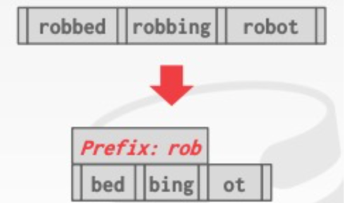

# B+ 树

一般用在表的索引上。  table Index

DBMS 使用一些特定的数据结构来存储信息：

- Internal Meta-data
- Core Data Storage
- Temporary Data Structures
- Table Indexes

本节将介绍存储 table index 最常用的树形数据结构：B+ Tree，Skip Lists，Radix Tree

# Table Index

table index 为提供 DBMS 数据查询的快速索引，它本身存储着某表某列排序后的数据，并包含指向相应 tuple 的指针。DBMS 需要保证表信息与索引信息在逻辑上保持同步。用户可以在 DBMS 中为任意表建立多个索引，DBMS 负责选择最优的索引提升查询效率。但索引自身需要占用存储空间，因此在索引数量与索引存储、维护成本之间存在权衡

存储开销    Storage Overhead

维护开销     MainTenance Overhead

## B+ Tree

B+ Tree 是一种自平衡树，它将数据有序地存储，且在 search、sequential access、insertions 以及 deletions 操作的复杂度上都满足 O(logn)，其中 sequential access 的最终复杂度还与所需数据总量有关。

使用B+树的好处：

B+ Tree 可以看作是 BST (Binary Search Tree) 的衍生结构，它的每个节点可以有多个 children，这特别契合 disk-oriented database 的数据存储方式，**每个 page 存储一个节点**，使得树的结构扁平化，减少获取索引给查询带来的 I/O 成本。

### B+ Tree Nodes

B+ Tree 中的每个 node 都包含一列按 key 排好序的 key/value pairs，key 就是 table index 对应的 column，value 的取值与 node 类型相关，在 inner nodes 和 leaf nodes 中存的内容不同。

leaf node 的 values 取值在不同数据库中、不同索引优先级中也不同，但总而言之，通常有两种做法：

- Record/Tuple Ids：存储指向最终 tuple 的指针      (类似MyISAM 存储引擎，需要去查另外一张表)

- Tuple Data：直接将 tuple data 存在 leaf node 中，但这种方式对于 [Secondary Indexes](https://docs.oracle.com/cd/E17275_01/html/programmer_reference/am_second.html) 不适用，因为 DBMS 只能将 tuple 数据存储到一个 index 中，否则数据的存储就会出现冗余，同时带来额外的维护成本。

  (这里说的  [Secondary Indexes](https://docs.oracle.com/cd/E17275_01/html/programmer_reference/am_second.html)  就可以理解为是第二索引 普通索引  普通索引 还需要去主键索引的B+数中去找数据)

此外，leaf node 还需要存储相邻 siblings 的地址以及其它一下元信息，如下图所示：

###  B+树和B树的区别

B树 B-Tree      中间节点又存索引又存储数据，每个索引出现一次，空间上更加高效

而B+Tree

数据只是存储在叶子节点，inner Nodes 中间节点只是引导搜索过程

### B+ Tree Operations

I*Insert*

1. 找到对应的 leaf node，L
2. 将 key/value pair 按顺序插入到 L 中
3. 如果 L 还有足够的空间，操作结束；如果空间不足，则需要将 L 分裂成两个节点，同时在 parent node 上新增 entry，若 parent node 也空间不足，则递归地分裂，直到 root node 为止。

*Delete*

1. 从 root 开始，找到目标 entry 所处的 leaf node, L
2. 删除该 entry
3. 如果 L 仍然至少处于半满状态，则操作结束；否则先尝试从 siblings 那里拆借 entries，如果失败，则将 L 与相应的 sibling 合并
4. 如果合并发生了，则可能需要递归地删除 parent node 中的 entry

有一种延迟合并的方案，减少 删除又重新插入导致的不必要的开销，可以减少B+树自组织的时间。

#### Merge Threshold

由于 merge 操作引起的修改较大，有些 DBMS 选择延迟 merge 操作的发生时间，甚至可以利用其它进程来负责周期性地重建 table index。

节点合并的话，不仅仅是叶子节点需要合并，上层的索引也要维护

B+Tree 的 Insert、Delete 过程，可参考[这里](https://www.cs.usfca.edu/~galles/visualization/BPlusTree.html)。

### B+数如何存储重复的key

1.把Record Id 作为索引的一部分。保证所有的key不同  比如    6 =>  {6,(page,slot)}  附加页号 和 slot 号

方法2 ： 允许叶子节点溢出到溢出节点中，即外链一个溢出的叶子节点，但是 维护起来更加的困难。

### B+数如何存储变长的Key 

1.存储指针  存储指向 key 的指针

2.节点本身是变长的      需要精细的内存管理操作

3.padding 补空字节

4. Key  Map/Indirection 	类似于槽slot 的思想   槽作为key   对应value

   用一个数组存储 key 到 value的映射

Key Map：内嵌一个指针数组，指向 node 中的 key/val list 

### B+数的 Node Size 如何确定

1.首先最好是文件页大小的整数倍 ,保证存取节点可以取出整数个文件页，方便磁盘管理。

2.设备存取速度越慢，节点放的数据应该越多。硬件设备慢，不应该多次存取，我们应该在一次读取就读尽可能多的页。但是读取的可能很多不需要的冗余数据。

3.设备很快的话，可以让节点放的页面更少，这样不容易读取到不需要的冗余无用数据。

Mysql目前节点大小和文件页一样 都是16 k 

4.经常要全表遍历的话(比如OLAP 型可以设置的大一些)，可以设置大一些，一次取回更多数据。如果是OLTP型数据库，经常点查询 （Root-to-leaf 查询），或者是少量查询，可以少一点，每次

### 聚集索引

数据是否按照主键索引组织，且数据集成在主键索引（叶子节点）中。

主键聚簇索引好处： 

​	 扫描方法： 找到最左边的叶子节点，然后从右去扫描所有的叶子节点。在磁盘上往往也是连续的。(自增的就很好)

比如如果使用非聚簇索引比如辅助索引，或者是没有如上递增特性的主键索引，则顺序和磁盘文件顺序不一致，找起来费劲。

优化方案：缓存方案，要查的都找出来，然后一次的把所有数据都读出来。

### 节点内部如何搜索页面

一个节点内 可能有很多条数据

1. 线性查找 
2. 二分查找 
3. 推断插入位置 Interpolation：通过 keys 的分布统计信息来估计大概位置进行检索

### 索引非唯一如何处理？

索引针对的 key 可能是非唯一的，通常有两种手段来应对：

1. Duplicate Keys：存储多次相同的 key
2. Value Lists：每个 key 只出现一次，但同时维护另一个链表，存储 key 对应的多个 values，类似 chained hashing

## B+树的优化方案

### Prefix Compression

同一个 leaf node 中的 keys 通常有相同的 prefix，如下图所示：

为了节省空间，可以只存所有 keys 的不同的 suffix。

### Suffix Truncation

由于 inner nodes 只用于引导搜索，因此没有必要在 inner nodes 中储存完整的 key，我们可以只存储足够的 prefix 即可，如下图所示：

### Bulk Insert

建 B+ Tree 的最快方式是先将 keys 排好序后，再从下往上建树

因此如果有大量插入操作，可以利用这种方式提高效率

### Pointer Swizzling

Nodes 使用 page id 来存储其它 nodes 的引用，DBMS 每次需要首先从 page table 中获取对应的内存地址，然后才能获取相应的 nodes 本身，如果 page 已经在 buffer pool 中，我们可以直接存储其它 page 在 buffer pool 中的内存地址作为引用，从而提高访问效率。

# 

