# 查询过程

Processing Models

Access Methods

Expression Evaluation

# Processing Model

DBMS 的 processing model 定义了系统如何执行一个 query plan，目前主要有三种模型:

- Iterator Model
- Materialization Model            物化   早物化 晚物化
- Vectorized/Batch Model

不同模型的适用场景不同。

## Iterator Model   迭代模式 

query plan 中的每步 operator 都实现一个 next 函数，每次调用时，operator 返回一个 tuple 或者 null，后者表示数据已经遍历完毕。operator 本身实现一个循环，每次调用其 child operators 的 next 函数，从它们那边获取下一条数据供自己操作，这样整个 query plan 就被从上至下地串联起来，它也称为 Volcano/Pipeline Model：

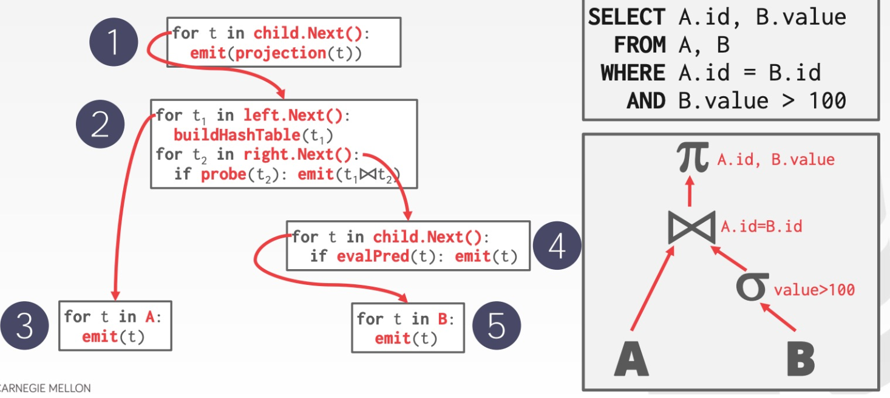

Query Processing

# 简介

如上图所示，通常一个 SQL 会被组织成树状的查询计划，数据从 leaf nodes 流到 root，查询结果在 root 中得出。而本节将讨论在这样一个计划中，如何为这个数据流动过程建模，大纲如下：

- 

  Processing Models

- 

  Access Methods

- 

  Expression Evaluation

# Processing Model

DBMS 的 processing model 定义了系统如何执行一个 query plan，目前主要有三种模型:

- Iterator Model
- Materialization Model
- Vectorized/Batch Model

不同模型的适用场景不同。

## Iterator Model

query plan 中的每步 operator 都实现一个 next 函数，每次调用时，operator 返回一个 tuple 或者 null，后者表示数据已经遍历完毕。operator 本身实现一个循环，每次调用其 child operators 的 next 函数，从它们那边获取下一条数据供自己操作，这样整个 query plan 就被从上至下地串联起来，它也称为 Volcano/Pipeline Model：

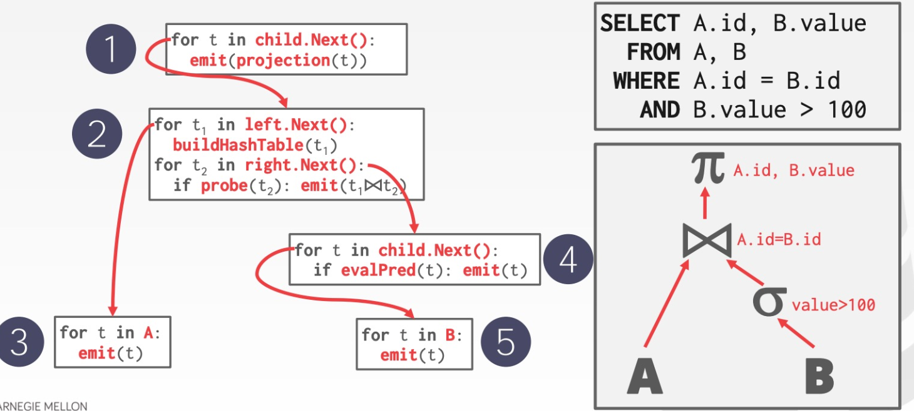

Iterator 几乎被用在每个 DBMS 中，包括 sqlite、MySQL、PostgreSQL 等等，其它需要注意的是：

- 有些 operators 会等待 children 返回所有 tuples 后才执行，如 Joins, Subqueries 和 Order By
- Output Control 在 Iterator Model 中比较容易，如 Limit，只按需调用 next 即可。

## Materialization Model

每个 operator 处理完所有输入后，将所有结果一次性输出，DBMS 会将一些参数传递到 operator 中防止处理过多的数据，这是一种从下至上的思路，示意如下：

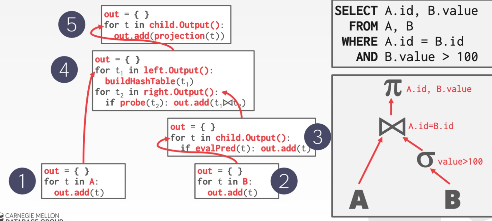

更适合 OLTP 场景，因为后者通常指需要处理少量的 tuples，这样能减少不必要的执行、调度成本

不太适合会产生大量中间结果的 OLAP 查询

早物化（后面记录整个行） 和晚物化(后面记录行id)

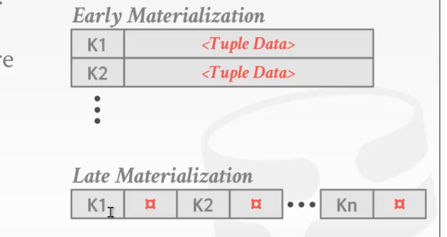

## Vectorization Model	

Vectorization Model 是 Iterator 与 Materialization Model 折衷的一种模型：

- 每个 operator 实现一个 next 函数，但每次 next 调用返回一批 tuples，而不是单个 tuple
- operator 内部的循环每次也是一批一批 tuples 地处理
- batch 的大小可以根据需要改变（hardware、query properties）

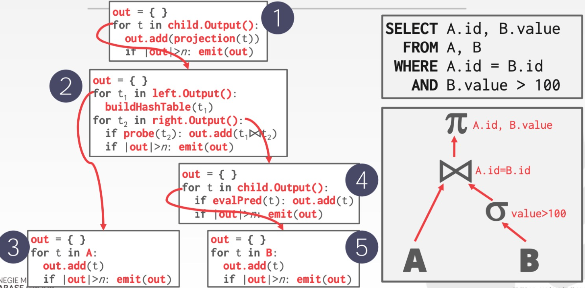

vectorization model 是 OLAP 查询的理想模型：

- 极大地减少每个 operator 的调用次数
- 允许 operators 使用 vectorized instructions (SIMD) 来批量处理 tuples

目前在使用这种模型的 DBMS 有 VectorWise, Peloton, Preston, SQL Server, ORACLE, DB2 等。

## 外部归并排序

### 2-way 归并排序

2个页

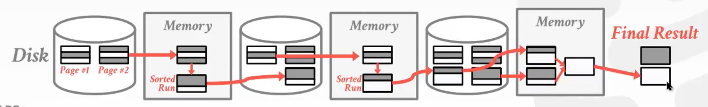

多个页

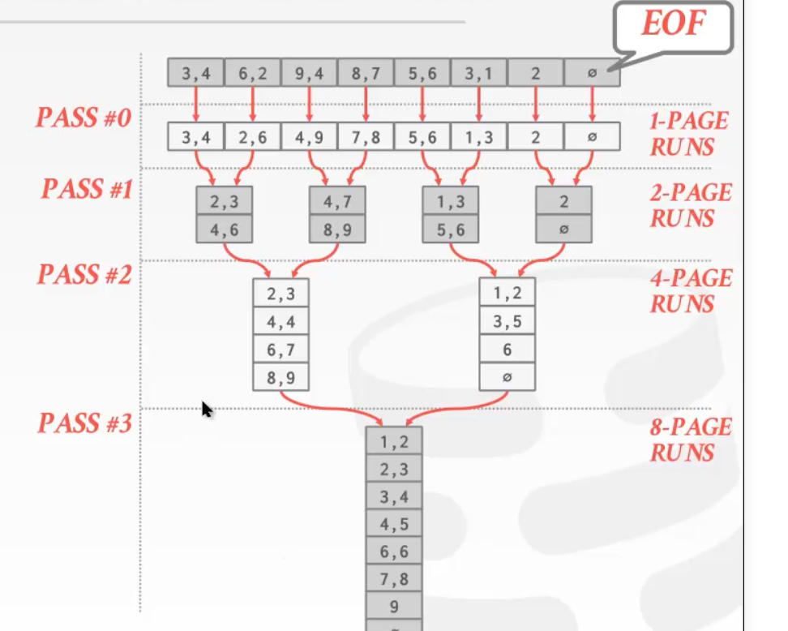

优化往哪些方向考虑： 预读取    缓存

优化1.  预读

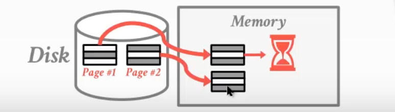

优化2. 使用更多的度数    减少归并排序的次数

5度

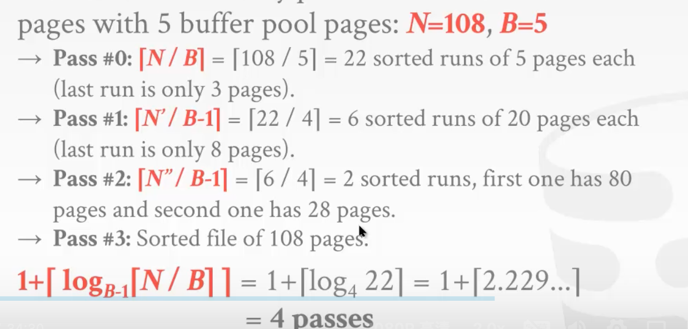

## Using B+ Tree for sorting

1.聚簇B+树

2.非聚簇B+ 树

叶子结点节点里面的数据和文件页里面的turple 是一一关联的

非聚簇是不关联的  需要排序

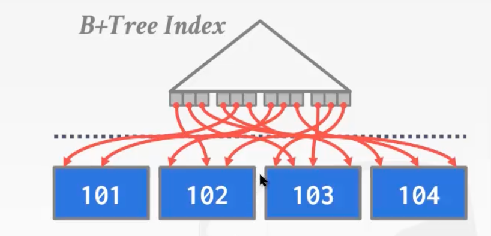

# Access Methods

access method 指的是 DBMS 从数据表中获取数据的方式，它并没有在 relational algebra 中定义。主要有三种方法：

- Sequential Scan
- Index Scan
- Multi-Index/"Bitmap" Scan

# Aggregations

ggregation 就是对一组 tuples 的某些值做统计，转化成一个标量，如平均值、最大值、最小值等，aggregation 的实现通常有两种方案：

- Sorting
- Hashing

Sorting Aggregation

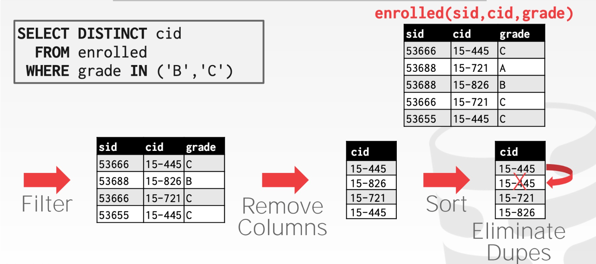

但很多时候我们并不需要排好序的数据，如：

- Forming groups in GROUP BY
- Removing duplicates in DISTINCT

这样的场景下 hashing 是更好的选择，它能有效减少排序所需的额外工作。

## Hashing Aggregation

利用一个临时 (ephemeral) 的 hash table 来记录必要的信息，即检查 hash table 中是否存在已经记录过的元素并作出相应操作：

- DISTINCT: Discard duplicate
- GROUP BY: Perform aggregate computation

如果所有信息都能一次性读入内存，那事情就很简单了，但如若不然，我们就得变得更聪明。

hashing aggregation 同样分成两步：

- Partition Phase: 将 tuples 根据 hash key 放入不同的 buckets        （分区后放在硬盘上  因为内存存不下）

  - use a hash function h1 to split tuples into partitions on disk
    - all matches live in the same partition
    - partitions are "spilled" to disk via output buffers
  - 这里有个额外的假设，即每个 partition 能够被放到 memory 中

- ReHash Phase: 在内存中针对每个 partition 利用 hash table 计算 aggregation 的结果

  (1.磁盘里面的哈希表太大  2.第一次哈希的结果可能发生了碰撞)

  所以每个bucket 一次次往内存中读取 , 然后rehash 

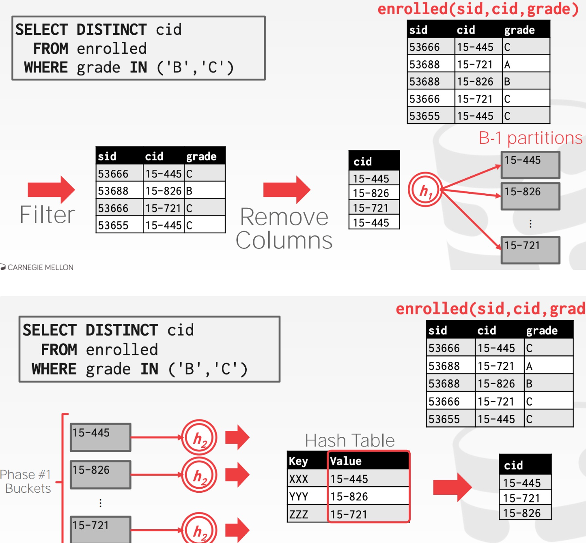

聚集函数    不用的聚集函数 value不一样    value称为 ”中间结果“

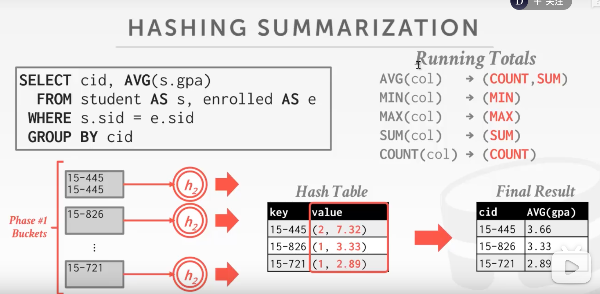

总结：

做Agg 时 ，选择hash 还是 sort 要看实际的执行情况，如果已经有序好 ，则应该选择排序。已经有hash的话可以直接选择hash

排序的优化方案：

1.多个文件页组成一个大的文件块 去聚集

2. 做 double-buffer 做一些预取的操作  增大缓存池  减少CPU IO的开销

