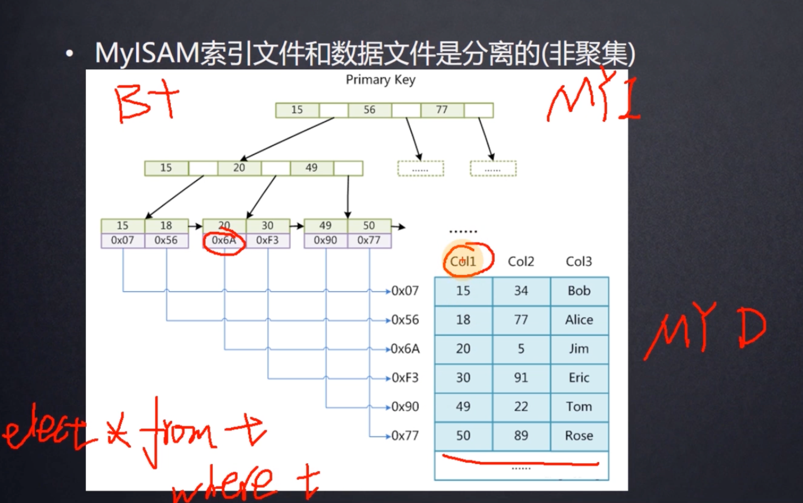

# MySQL 索引  B+ 树

## 1.为什么不用二叉树

如果递增，则退化为链表 ， 全表扫描

长度太长

## 2.红黑树

特点： 有自我平衡的特性。二叉平衡树      ”二叉“

而为什么不用红黑树呢？

由于其二叉的特性，树的长度太高了，大数据量查找效率越来越低。

我们要实现树的高度在一定范围内，还能大量的数据呢。==》 多路树

## 3.B树  B-Tree

如何实现自平衡的特性？

## 4.B+树

高度为3的B+ 树 可以存放多少索引？ 计算一下

假设主键索引为bigint 为8 个字节， 一个索引后面跟一个下一个页的磁盘文件地址 底层为6个字节大小

一个节点 放满所有字节    大约为 16Kb/(6+8)b  = 1170

下一层一个页也是1170

最后一层的叶子节点    一般一个索引+一个data元素，data元素可能是索引行的所在磁盘文件的地址 也可能是这一行其他列的数据 ，撑死占用1KB， 可以放16个索引元素 

全部放满 ， 叶子节点可以放   1170 * 1170 * 1KB  ~= 2000多w的索引

一个节点内的元素 从左递增，查找时，节点Load到内存 ， 折半查找，定位元素非常快，相对于IO可忽略。

Mysql 中，冗余的非叶子节点，启动的时候就加载到内存中。

查找某个索引 ，几乎只要做一次磁盘IO。

##  B+树和B树的区别

B树 B-Tree      中间节点又存索引又存储数据，每个索引出现一次，空间上更加高效

而B+Tree

数据只是存储在叶子节点，inner Nodes 中间节点只是引导搜索过程

## 数据库的存储引擎

###  MyISAM

 

### InnoDB

聚集索引    也就是  叶子节点包含了完整的数据记录

MyISAM    把 索引文件和数据文件分离 也就是非聚集的 	

效率上 ： 聚集索引 不需要回表  一般来说效率更高一些 .

如果使用普通索引，则数据存储的是所在行的主键，则会再去主键索引B+数中寻找。

为什么聚集索引需要建立一个主键索引？且最好自增？

不用主键的话，mysql去找每一列，找到可以建立唯一索引的一列，这一列元素必须不相同，构建一颗B+数。找不到mysql帮助你维护一颗rowId 隐藏列。自己建主键的话，让mysql少做点事，提升性能。  为什么整形？ 整形比大小 效率比字符串高，自增主要是

这里谈到范围查找  不得不回忆一下哈希表：  查找效率更高 ， 但是范围查询不行

